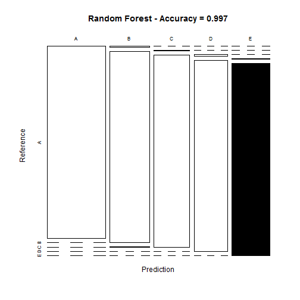
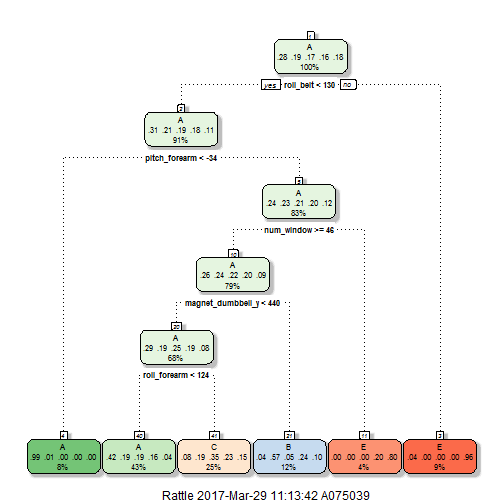
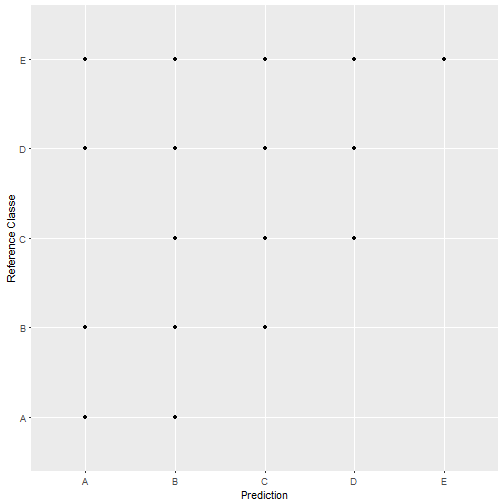

# Machine Learning - Course Project - Week 4
#### By Sanjay Jain - March 29,2017

## Executive Summary

It is very common to quantify how long a particular activity was done during workout but the aim of this project is to predict how "well" exercise was done. It is based on readings of the data from accelerometers on the belt, forearm, arm, and dumbell of 6 participants. They were asked to perform barbell lifts correctly and incorrectly in 5 different ways. 

This project performs different steps like loading the training and testing data, cleaning the data, partitioning the data in training and test category, cross validation of data, creating model using different techniques on training data and predicting test data using these models, finding the model with best prediction accuracy and use that model on given 20 samples to predict how well (correctly or incorrectly) exercise was done in those 20 samples.     

## Loading and Cleaning the Raw Data

The training data for this project are available here:

[https://d396qusza40orc.cloudfront.net/predmachlearn/pml-training.csv](https://d396qusza40orc.cloudfront.net/predmachlearn/pml-training.csv)

The test data are available here:

[https://d396qusza40orc.cloudfront.net/predmachlearn/pml-testing.csv](https://d396qusza40orc.cloudfront.net/predmachlearn/pml-testing.csv)

The data for this project come from this source: [http://groupware.les.inf.puc-rio.br/har](http://groupware.les.inf.puc-rio.br/har) 

Load following packages -

```r
library(ggplot2)
library(lubridate)
library(caret)
library(e1071)
library(randomForest)
library(rattle)
library(rpart.plot)
library(rmarkdown)
library(markdown) 
```

### Loading the data

Load training data set. Missing values are coded as blank fields. 


```r
cp_training <- read.csv(url("https://d396qusza40orc.cloudfront.net/predmachlearn/pml-training.csv"), na.strings = c("NA", ""))
```
After loading, check the data -


```r
dim(cp_training)
```

```
## [1] 19622   160
```

Load test cases data set. Missing values are coded as blank fields. 


```r
cp_testcases <- read.csv(url("https://d396qusza40orc.cloudfront.net/predmachlearn/pml-testing.csv"), na.strings = c("NA", ""))
```
After loading, check the data -


```r
dim(cp_testcases)
```

```
## [1]  20 160
```
### Cleaning the data

#### Remove columns with NA
Check column sums. If column sum is zero that means it does not have NA value. See how many columns are there with zero column sum and then select only those.


```r
table(colSums(is.na(cp_training)))
```

```
## 
##     0 19216 
##    60   100
```

```r
cp_training <- cp_training[, colSums(is.na(cp_training)) == 0]


table(colSums(is.na(cp_testcases)))
```

```
## 
##   0  20 
##  60 100
```

```r
cp_testcases <- cp_testcases[, colSums(is.na(cp_testcases)) == 0]
```
Select only relevant predictors. First 5 columns (X, user_name, raw_timestamp_part_1, raw_timestamp_part_2 and cvtd_timestamp) do not seem to be relevant to our analysis so remove them -


```r
cp_training <- cp_training[, -(1:5)]

cp_testcases <- cp_testcases[, -(1:5)]
```
Check rows and columns in cleaned data. We have now total 55 columns left for our analysis.

```r
dim(cp_training)
```

```
## [1] 19622    55
```

```r
dim(cp_testcases)
```

```
## [1] 20 55
```

## Cross Validation

### Split training data into train and test sets -


```r
set.seed(12345)
inTrain <- createDataPartition(y=cp_training$classe, p= 0.7, list = FALSE)
cp_train <- cp_training[inTrain,]
cp_test <- cp_training[-inTrain,]
```
### Building models on training data set

#### Model-1 - Random forest

**Building the model**

I am using random forest method for my first model because it is considered to be one of the most accurate algorithms. Using 5 fold cross validation - 


```r
set.seed(12345)
mod_rf <- train(classe~., data=cp_train, method="rf", prox=TRUE, trControl=trainControl(method="cv", 5))
mod_rf
```

```
## Random Forest 
## 
## 13737 samples
##    54 predictor
##     5 classes: 'A', 'B', 'C', 'D', 'E' 
## 
## No pre-processing
## Resampling: Cross-Validated (5 fold) 
## Summary of sample sizes: 10989, 10989, 10989, 10990, 10991 
## Resampling results across tuning parameters:
## 
##   mtry  Accuracy   Kappa    
##    2    0.9933756  0.9916200
##   28    0.9966514  0.9957643
##   54    0.9931565  0.9913435
## 
## Accuracy was used to select the optimal model using  the largest value.
## The final value used for the model was mtry = 28.
```
We see that accuracy is more than 0.99 in all mtry so this model looks good to evaluate testing data set. 

**Evaluate model on test data set**


```r
pred_mod_rf <- predict(mod_rf, cp_test)
confusion_Matrix <- confusionMatrix(cp_test$classe, pred_mod_rf)
confusion_Matrix
```

```
## Confusion Matrix and Statistics
## 
##           Reference
## Prediction    A    B    C    D    E
##          A 1674    0    0    0    0
##          B    5 1133    1    0    0
##          C    0    3 1023    0    0
##          D    0    0    7  957    0
##          E    0    0    0    4 1078
## 
## Overall Statistics
##                                           
##                Accuracy : 0.9966          
##                  95% CI : (0.9948, 0.9979)
##     No Information Rate : 0.2853          
##     P-Value [Acc > NIR] : < 2.2e-16       
##                                           
##                   Kappa : 0.9957          
##  Mcnemar's Test P-Value : NA              
## 
## Statistics by Class:
## 
##                      Class: A Class: B Class: C Class: D Class: E
## Sensitivity            0.9970   0.9974   0.9922   0.9958   1.0000
## Specificity            1.0000   0.9987   0.9994   0.9986   0.9992
## Pos Pred Value         1.0000   0.9947   0.9971   0.9927   0.9963
## Neg Pred Value         0.9988   0.9994   0.9984   0.9992   1.0000
## Prevalence             0.2853   0.1930   0.1752   0.1633   0.1832
## Detection Rate         0.2845   0.1925   0.1738   0.1626   0.1832
## Detection Prevalence   0.2845   0.1935   0.1743   0.1638   0.1839
## Balanced Accuracy      0.9985   0.9980   0.9958   0.9972   0.9996
```

```r
accuracy <- postResample(pred_mod_rf, cp_test$classe)
accuracy
```

```
##  Accuracy     Kappa 
## 0.9966015 0.9957009
```

```r
error <- 1 - as.numeric(confusion_Matrix$overall[1])
error
```

```
## [1] 0.003398471
```
** Estimated accuracy of random forest model is 99.66% and out of sample error is 0.34%. ** 

** Plotting Confusion matrix results **

```r
plot(confusion_Matrix$table, col = confusion_Matrix$byClass,  main = paste("Random Forest - Accuracy =",round(confusion_Matrix$overall[1], 3)))
```



#### Model-2 - Decision Tree (rpart)

Use the same training (cp_train) and test (cp_test) dataset as created above

**Building the Tree model**


```r
set.seed(12345)
mod_tree <- train(classe~., data=cp_train, method="rpart")
mod_tree$finalModel
```

```
## n= 13737 
## 
## node), split, n, loss, yval, (yprob)
##       * denotes terminal node
## 
##  1) root 13737 9831 A (0.28 0.19 0.17 0.16 0.18)  
##    2) roll_belt< 129.5 12512 8649 A (0.31 0.21 0.19 0.18 0.11)  
##      4) pitch_forearm< -33.95 1093   10 A (0.99 0.0091 0 0 0) *
##      5) pitch_forearm>=-33.95 11419 8639 A (0.24 0.23 0.21 0.2 0.12)  
##       10) num_window>=45.5 10901 8121 A (0.26 0.24 0.22 0.2 0.085)  
##         20) magnet_dumbbell_y< 439.5 9307 6587 A (0.29 0.19 0.25 0.19 0.082)  
##           40) roll_forearm< 123.5 5861 3418 A (0.42 0.19 0.19 0.16 0.042) *
##           41) roll_forearm>=123.5 3446 2249 C (0.08 0.19 0.35 0.23 0.15) *
##         21) magnet_dumbbell_y>=439.5 1594  688 B (0.038 0.57 0.05 0.24 0.1) *
##       11) num_window< 45.5 518  106 E (0 0 0 0.2 0.8) *
##    3) roll_belt>=129.5 1225   43 E (0.035 0 0 0 0.96) *
```
** Plotting Tree model **


```r
fancyRpartPlot(mod_tree$finalModel)
```



**Evaluate model on test data set**


```r
pred_mod_tree <- predict(mod_tree, cp_test)
 
confusion_Matrix_tree <- confusionMatrix(cp_test$classe, pred_mod_tree)

confusion_Matrix_tree
```

```
## Confusion Matrix and Statistics
## 
##           Reference
## Prediction    A    B    C    D    E
##          A 1494   21  128    0   31
##          B  470  380  289    0    0
##          C  467   29  530    0    0
##          D  416  184  324    0   40
##          E   95   90  219    0  678
## 
## Overall Statistics
##                                           
##                Accuracy : 0.5237          
##                  95% CI : (0.5109, 0.5365)
##     No Information Rate : 0.4999          
##     P-Value [Acc > NIR] : 0.0001376       
##                                           
##                   Kappa : 0.3791          
##  Mcnemar's Test P-Value : < 2.2e-16       
## 
## Statistics by Class:
## 
##                      Class: A Class: B Class: C Class: D Class: E
## Sensitivity            0.5078  0.53977  0.35570       NA   0.9052
## Specificity            0.9388  0.85350  0.88714   0.8362   0.9213
## Pos Pred Value         0.8925  0.33363  0.51657       NA   0.6266
## Neg Pred Value         0.6561  0.93173  0.80243       NA   0.9852
## Prevalence             0.4999  0.11963  0.25319   0.0000   0.1273
## Detection Rate         0.2539  0.06457  0.09006   0.0000   0.1152
## Detection Prevalence   0.2845  0.19354  0.17434   0.1638   0.1839
## Balanced Accuracy      0.7233  0.69664  0.62142       NA   0.9133
```

```r
accuracy_tree <- postResample(pred_mod_tree, cp_test$classe)
accuracy_tree
```

```
##  Accuracy     Kappa 
## 0.5237043 0.3790994
```

```r
error_tree <- 1 - as.numeric(confusion_Matrix_tree$overall[1])
error_tree
```

```
## [1] 0.4762957
```
** Estimated accuracy of Tree forest model is 52.37% and out of sample error is 47.63%. **


#### Model-3 - Gradient Boosting Model (gbm) 

Use the same training (cp_train) and test (cp_test) dataset as created above

**Building the gbm model**


```r
set.seed(12345)
mod_gbm <- train(classe~., data=cp_train, method="gbm", verbose = FALSE)
mod_gbm
```

```
## Stochastic Gradient Boosting 
## 
## 13737 samples
##    54 predictor
##     5 classes: 'A', 'B', 'C', 'D', 'E' 
## 
## No pre-processing
## Resampling: Bootstrapped (25 reps) 
## Summary of sample sizes: 13737, 13737, 13737, 13737, 13737, 13737, ... 
## Resampling results across tuning parameters:
## 
##   interaction.depth  n.trees  Accuracy   Kappa    
##   1                   50      0.7612942  0.6970159
##   1                  100      0.8301441  0.7848991
##   1                  150      0.8671026  0.8317630
##   2                   50      0.8823073  0.8509167
##   2                  100      0.9360506  0.9190523
##   2                  150      0.9610898  0.9507559
##   3                   50      0.9285915  0.9095693
##   3                  100      0.9687535  0.9604545
##   3                  150      0.9838220  0.9795291
## 
## Tuning parameter 'shrinkage' was held constant at a value of 0.1
## 
## Tuning parameter 'n.minobsinnode' was held constant at a value of 10
## Accuracy was used to select the optimal model using  the largest value.
## The final values used for the model were n.trees = 150,
##  interaction.depth = 3, shrinkage = 0.1 and n.minobsinnode = 10.
```

```r
mod_gbm$finalModel
```

```
## A gradient boosted model with multinomial loss function.
## 150 iterations were performed.
## There were 54 predictors of which 41 had non-zero influence.
```

**Evaluate model on test data set**


```r
pred_mod_gbm <- predict(mod_gbm, cp_test)
 
confusion_Matrix_gbm <- confusionMatrix(cp_test$classe, pred_mod_gbm)

confusion_Matrix_gbm
```

```
## Confusion Matrix and Statistics
## 
##           Reference
## Prediction    A    B    C    D    E
##          A 1670    4    0    0    0
##          B   11 1117   11    0    0
##          C    0   22  998    6    0
##          D    2    5   13  944    0
##          E    1    1    3    5 1072
## 
## Overall Statistics
##                                           
##                Accuracy : 0.9857          
##                  95% CI : (0.9824, 0.9886)
##     No Information Rate : 0.2862          
##     P-Value [Acc > NIR] : < 2.2e-16       
##                                           
##                   Kappa : 0.9819          
##  Mcnemar's Test P-Value : NA              
## 
## Statistics by Class:
## 
##                      Class: A Class: B Class: C Class: D Class: E
## Sensitivity            0.9917   0.9721   0.9737   0.9885   1.0000
## Specificity            0.9990   0.9954   0.9942   0.9959   0.9979
## Pos Pred Value         0.9976   0.9807   0.9727   0.9793   0.9908
## Neg Pred Value         0.9967   0.9933   0.9944   0.9978   1.0000
## Prevalence             0.2862   0.1952   0.1742   0.1623   0.1822
## Detection Rate         0.2838   0.1898   0.1696   0.1604   0.1822
## Detection Prevalence   0.2845   0.1935   0.1743   0.1638   0.1839
## Balanced Accuracy      0.9954   0.9838   0.9839   0.9922   0.9990
```

```r
accuracy_gbm <- postResample(pred_mod_gbm, cp_test$classe)
accuracy_gbm
```

```
##  Accuracy     Kappa 
## 0.9857264 0.9819408
```

```r
error_gbm <- 1 - as.numeric(confusion_Matrix_gbm$overall[1])
error_gbm
```

```
## [1] 0.01427358
```
** Estimated accuracy of gbm model is 98.57% and out of sample error is 1.43%. **

**Plotting the prediction result **


```r
qplot(pred_mod_gbm, classe, data = cp_test, xlab = "Prediction", ylab = "Reference Classe")
```



## Model Selection Conclusion 


* Model 1 - Random Forest - Accuracy - 99.66%, 		Error - 0.34%
* Model 2 - Decision Tree - Accuracy - 52.37%, 	Error - 47.63%
* Model 3 - GBM		    - Accuracy - 98.57%, 	Error - 1.43% 

We see that Model 1 (Random Forest) has highest accuracy and lowest error rate. Model 2 (Decision Tree) has lowest accuracy and highest error rate. Model 3 (gbm) is in between 1 and 2. Infact it is very close to Model 1 (random forest) in terms of accuracy and error. 
Based on this conclusion, I am selecting Model 1 (random forest) to run prediction on data set with 20 samples. 

## Running selected model on Test data

Here we'll try to predict classe in the sample of 20 test cases based on random forest model (model-1).


```r
predict(mod_rf, cp_testcases)
```

```
##  [1] B A B A A E D B A A B C B A E E A B B B
## Levels: A B C D E
```

